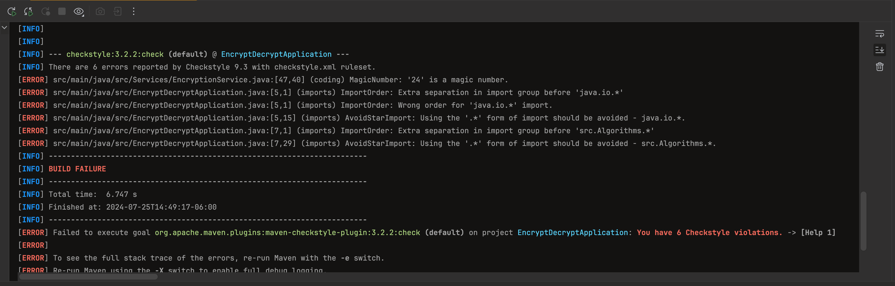

# Encryption-Decryption

This application encrypts and decrypts texts by using two algorithms: shift and unicode algorithm.
The first one shifts every letter n times in alphabet-right-wise. The second one uses the
unicode representation of the character to shift it n times to the right according to the unicode
characters table. It is possible to set the times desired to be every character moved regardless
the algorithm. You can also specify whether it is on encrypt or decrypt mode. All these behaviours
are defined through the program arguments as follows:

| Command         | Description                                                                                                                                                                                                  |
|-----------------|--------------------------------------------------------------------------------------------------------------------------------------------------------------------------------------------------------------|
| `-mode <value>` | This can only take two values: "enc" or "dec". The first one is a short-term for encrypt and the second one for decrypt.                                                                                     |
| `-key <value>`  | This takes an integer value that represents the number of times the algorithm will move every character to the right (or to the left in case of `dec` mode).                                                 |
| `-data <value>` | Reads a string representing the text to be encrypted or decrypted.                                                                                                                                           |
| `-in <value>`   | Takes a file name representing the file where the input text is located and attempts to read it. If this argument is present, the program will ignore any data from the `-data` argument, if it was present. |
| `-out <value>`  | Takes a file name representing the file where the application output will be written.                                                                                                                        |
| `-alg <value>`  | This can only take two values: "shift" or "unicode". This sets the application's algorithm.                                                                                                                  |

This project has only one class named "src.Main" with the main method in it. The program starts by
reading the user arguments since this application is intended to work with these values. In case there
are arguments missing from the user, all of them will take a default pre-defined value:

default values

| Argument | Value   |
|----------|---------|
| `-mode`  | "enc"   |
| `-key`   | "0"     |
| `-data`  | ""      |
| `-in`    | null    |
| `-out`   | null    |
| `-alg`   | "shift" |

After every parameter is set, the program performs the encrypt or decrypt operations and ends printing
the output to the console or just writing out the output to the output file if was asked for.

## Report - Static code analysis task

I was asked to integrate tools like PMD, maven checkstyle and spotbugs plugins. The first two are focused on verifying the quality of the code by checking, for example, naming conventions,
magic numbers etc. The last one is a tool that categorizes bugs into ten categories such as: bad practice, correctness, security etc. 

To integrate PMD into our project, I needed to add the dependency `maven-pmd-plugin` from `org.apache.maven.plugins` into the *POM.xml* file. Moreover, a *checkstyle.xml* file was needed 
to define the rules under this plugin will perform the checking operations. In case issues exist, the build will fail.

Adding maven checkstyle plugin was as easy as importing the `maven-checkstyle-plugin` from `org.apache.maven.plugins`. This automatically generates reports during the verification phase and
in case issues exist, the build will fail.

After running these coding style tools I obtained this: 

I had to put my hands on work to fix these style issues. Afterwards, the output of running the `verify` maven command the output was this: 

So, every style issue was properly corrected.

The spotbugs plugin was simply added through this plugin `spotbugs-maven-plugin` from `com-github-spotbugs`. This plugin was added into the *build* section
and the *reporting* section inside the POM.xml file. The report thrown this: 

After fixing these issues, there were no classes with bugs in them: 

And that's was a demostration on how these tools work together!